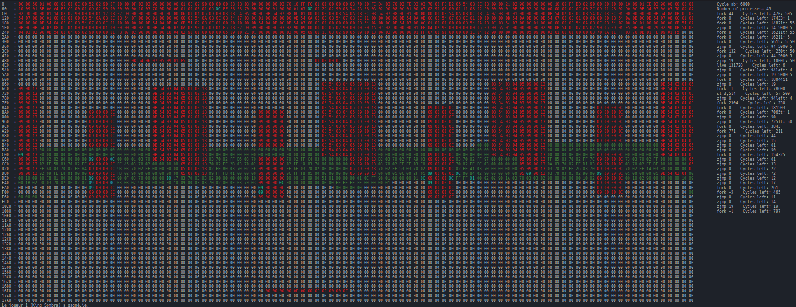

# <span>Project : Corewar</span>
### <span >EPITECH PROJECT, 2023</span>
### <span >Made by Théodore BILLOTTE, Marton ROUX, Guillaume TRAN, Louis ROLLET</span>

# <span >Description:</span>

<span>The Corewar project is a game in which several programs called "Champions" will fight to stay the last one
alive. Corewar is actually a computer simulation in which processors will share memory to run on.
The project is based on a virtual machine in which the champions will fight for memory by all possible
means in order to win, the last champion being able to signal that he is alive wins the game. In other words,
the last champion to execute the "live" instruction is declared winner.</span>


# <span>How to play:</span>

## Compile the game:
```make``` <span>or</span> ```make re``` <span>in the root folder.</span>

## Asm part:
<span>First you need to compile your champion with the asm binary.</span>

```./asm champion.s```

<span>It will create a champion.cor file.</span>

## Corewar part:

<span>Then you can launch the game with :</span>

```./corewar champion.cor```

<span>You can add up to 4 champions.</span>

<span>You can add the -dump flag to dump the memory at the end of the game in hexadecimal.</span>

```./corewar -dump 0B champion.cor```

<span>You can add the -n flag to chose the number of the champion.</span>

```./corewar -n 1 champion.cor```

<span>You can add the -a flag to chose the address of the champion.</span>

```./corewar -a 100 champion.cor```


<span>You can add the -h flag to get help.</span>

```./corewar -h```

## How to win:

<span>You win when your champion is the last one alive.</span>

## How to lose:

<span>You lose when your champion is dead (when no more process in on or the process does not says it's alive anymore).</span>

# Bonus:

## Visualizer:

<span>When you run the corewar with -d argument, the visualizer will be enabled</span>

```./corewar -d champion.cor champion.cor```

<span>Here is the visualizer:</span>

